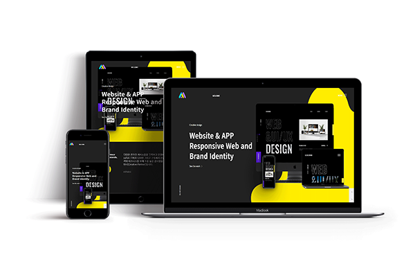
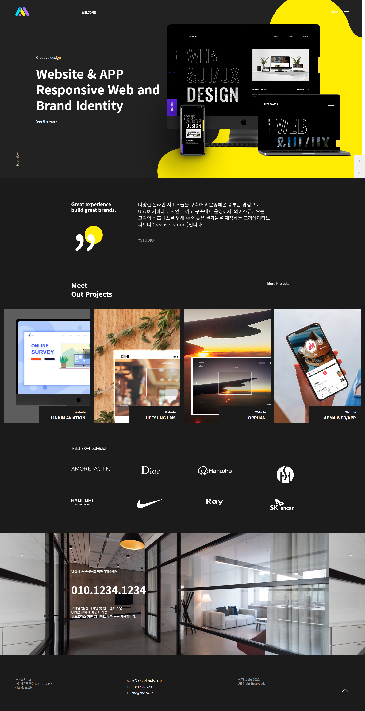

# 📌 Y Studio 클론코딩

### 에이전시 와이스튜디오

## 💻 Clone Coding 
**웹 에이전시 와이스튜디오(Y studio)의 클론코딩 웹사이트입니다.** GD WEB(지디웹) 선정작이며 반응형으로 제작하였습니다.   
검은색 배경에 노란색의 포인트를 살린 디자인이 특징입니다.  
Scrolla.js, Slick.js 라이브러리를 사용하였습니다.

 

### 👀 클론코딩 사이트 보기 (Click to View) 
👉 <https://breeghty.github.io/Ystudio_clonecoding/>

 

### ✔ 작업일자(Date)
2022.09.

 

### ✔ 키워드(Keyword)
- 클론코딩 100%
- 웹표준, 웹접근성, 반응형웹
- HTML, CSS, Javascript, jQuery
- GD WEB(지디웹) 선정작, Scrolla.js, Slick.js

 

### ✔ 풀페이지(Full page)

